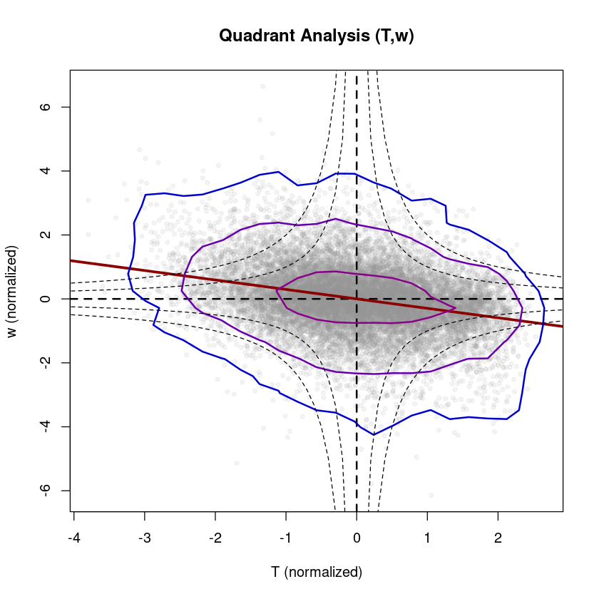

# Quadrant analysis

Quadrant analysis is a simple conditional sampling method to detect coherent structures directly from the high-frequency measurements (e.g. @Wallace2016). For this, the Reddy package provides two functions: `calc_quadrant_analysis` for calculating occurrence frequency and strength of the four quadrants and `plot_quadrant_analysis` for plotting the two variables as scatter plot with a 2d kernel density estimation and a linear regression, as detailed below.


```R
#loading Reddy package
install.packages("../src/Reddy_0.0.0.9000.tar.gz",repos=NULL,source=TRUE,quiet=TRUE)
library(Reddy)

#ec data files
dir_in="../data/ec-data_10Hz_raw"
files=list.files(dir_in,full.names=TRUE)
nf=length(files)
```

## Calculation of occurrence frequencies and strengths of the four quadrants with `calc_quadrant_analysis`
The two variables are normalized (if `do_normalization = TRUE`) through
$$ \hat{x} = \frac{x-\overline{x}}{\sigma_x}$$
by substracting the mean value $\overline{x}$ and dividing by $\sigma_x$ to make different variables with different value ranges comparable and centered around zero. The function counts the occurrence frequency of each quadrant, calculates their strength as product $\hat{x}\hat{y}$ and as covariance $\overline{\hat{x}'\hat{y}'}$. The parameter `hole_sizes`can be used to filter out very strong events by applying the filter conditions $\vert \hat{x}\hat{y} \vert \le H \cdot \vert \overline{\hat{x}'\hat{y}'}\vert$. Usually, $y$ is chosen to be the vertical velocity $w$. The quadrant analysis is directly related to the fluxes by using the respective constituting quantities: $(u,w)$ for momentum flux, $(T,w)$ for sensible heat flux, $(q,w)$ for latent heat flux and $(c,w)$ for CO$_2$ flux -- as visualized in the figure (adapted from @Mack2024).


```R
i=8 #select a file
tmp=read.table(files[i],sep=",",header=T)

qa_Tw=calc_quadrant_analysis(tmp$T_degC,tmp$w_m.s) #based on the raw data (10 Hz) directly (i.e., unrotated)
str(qa_Tw)
```

    List of 8
     $ hole_sizes       : int [1:11] 0 1 2 3 4 5 6 7 8 9 ...
     $ occurrence       : int [1:4, 1:11] 5448 2975 6619 2958 4689 144 3812 300 4232 8 ...
     $ product          : num [1:4, 1:11] 1.068 -0.291 0.619 -0.42 0.816 ...
     $ covariance       : num [1:4, 1:11] 0.10672 0.05309 -0.00914 0.03226 0.31902 ...
     $ covariance_total : num 0.15
     $ correlation_total: num 0.434
     $ product_total    : num [1:18000] 0.0448 -0.0544 -0.4983 0.115 0.3095 ...
     $ meta             : chr "Output format: rows represent the quadrants Q1, Q2, Q3, Q4 -- columns represent selected hole sizes"


## Plotting quadrant analysis with `plot_quadrant_analysis`
`plot_quadrant_analysis` plots a scatter plot of two variables with a 2d kernel density estimation (`MASS::kde2d`) and a linear regression (`lm()`) to allow for a visual inspection.

**Example: Quadrant Analysis (T,w) during daytime**


```R
i=8 #select a file -- a daytime example
print(files[i])
tmp=read.table(files[i],sep=",",header=T)

plot_quadrant_analysis(tmp$T_degC,tmp$w_m.s,xlab="T (normalized)",ylab="w (normalized)",main="Quadrant Analysis (T,w)")
```

    [1] "../data/ec-data_10Hz_raw/2018-07-20T120000.csv"
    
    Call:
    lm(formula = yval ~ xval)
    
    Residuals:
        Min      1Q  Median      3Q     Max 
    -4.5818 -0.5491  0.0005  0.5471  4.1136 
    
    Coefficients:
                  Estimate Std. Error t value Pr(>|t|)    
    (Intercept) -3.849e-16  6.716e-03    0.00        1    
    xval         4.337e-01  6.716e-03   64.58   <2e-16 ***
    ---
    Signif. codes:  0 ‘***’ 0.001 ‘**’ 0.01 ‘*’ 0.05 ‘.’ 0.1 ‘ ’ 1
    
    Residual standard error: 0.9011 on 17998 degrees of freedom
    Multiple R-squared:  0.1881,	Adjusted R-squared:  0.1881 
    F-statistic:  4170 on 1 and 17998 DF,  p-value: < 2.2e-16
    


    
{width=500}
    


**Example: Quadrant Analysis (T,w) during nighttime**


```R
i=38 #select a file -- a nighttime example
print(files[i])
tmp=read.table(files[i],sep=",",header=T)
plot_quadrant_analysis(tmp$T_degC,tmp$w_m.s,xlab="T (normalized)",ylab="w (normalized)",main="Quadrant Analysis (T,w)") #based on the raw data (10 Hz) directly (i.e., unrotated)
```

    [1] "../data/ec-data_10Hz_raw/2018-07-21T030000.csv"
    
    Call:
    lm(formula = yval ~ xval)
    
    Residuals:
        Min      1Q  Median      3Q     Max 
    -5.8334 -0.5262  0.0022  0.5425  6.2520 
    
    Coefficients:
                  Estimate Std. Error t value Pr(>|t|)    
    (Intercept) -3.006e-17  7.120e-03    0.00        1    
    xval        -2.957e-01  7.121e-03  -41.53   <2e-16 ***
    ---
    Signif. codes:  0 ‘***’ 0.001 ‘**’ 0.01 ‘*’ 0.05 ‘.’ 0.1 ‘ ’ 1
    
    Residual standard error: 0.9553 on 17998 degrees of freedom
    Multiple R-squared:  0.08745,	Adjusted R-squared:  0.0874 
    F-statistic:  1725 on 1 and 17998 DF,  p-value: < 2.2e-16
    


    
{width=500}
    


**Example: Quadrant Analysis (u,w) during nighttime**


```R
plot_quadrant_analysis(tmp$u_m.s,tmp$w_m.s,xlab="u (normalized)",ylab="w (normalized)",main="Quadrant Analysis (u,w)") #based on the raw data (10 Hz) directly (i.e., unrotated)
```

    
    Call:
    lm(formula = yval ~ xval)
    
    Residuals:
        Min      1Q  Median      3Q     Max 
    -5.9799 -0.5474 -0.0342  0.5301  6.6338 
    
    Coefficients:
                  Estimate Std. Error t value Pr(>|t|)    
    (Intercept) -3.749e-16  7.326e-03    0.00        1    
    xval        -1.843e-01  7.326e-03  -25.15   <2e-16 ***
    ---
    Signif. codes:  0 ‘***’ 0.001 ‘**’ 0.01 ‘*’ 0.05 ‘.’ 0.1 ‘ ’ 1
    
    Residual standard error: 0.9829 on 17998 degrees of freedom
    Multiple R-squared:  0.03395,	Adjusted R-squared:  0.0339 
    F-statistic: 632.5 on 1 and 17998 DF,  p-value: < 2.2e-16
    


    
{width=500}
    


Quadrant analysis can be applied to any combination of two measured quantities and also allows to check the measurement quality or significance of the relation between them. It can also be used to check the effect of the coordinate rotation (e.g., `rotate_double`) visually.
