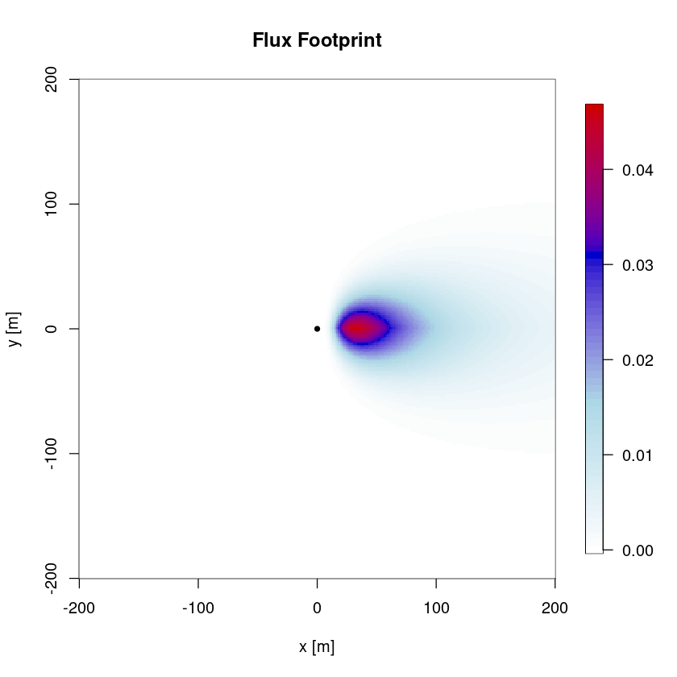
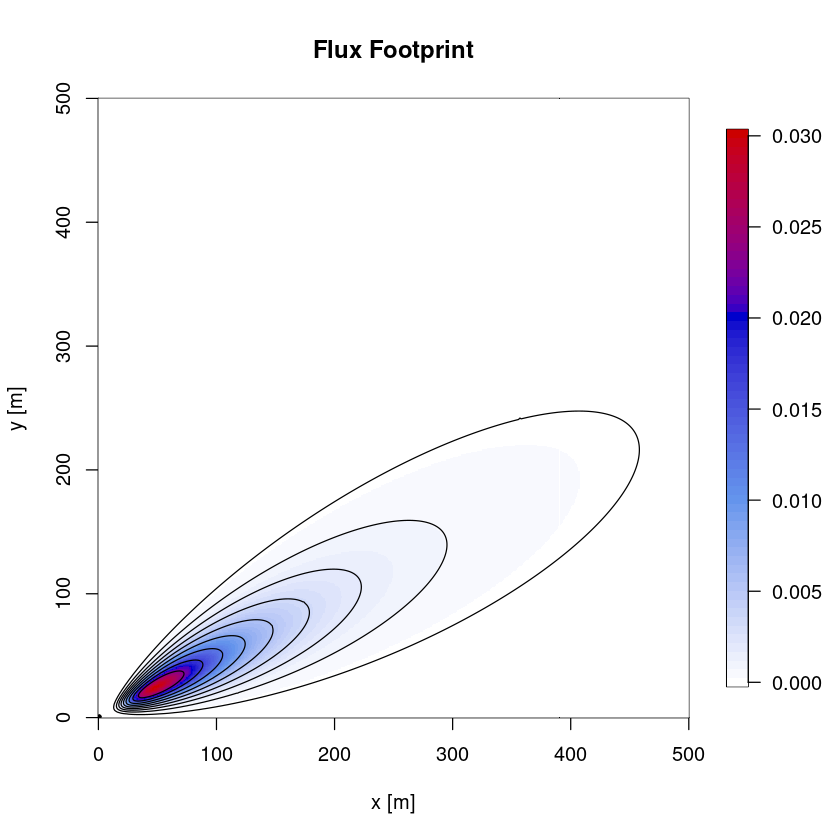
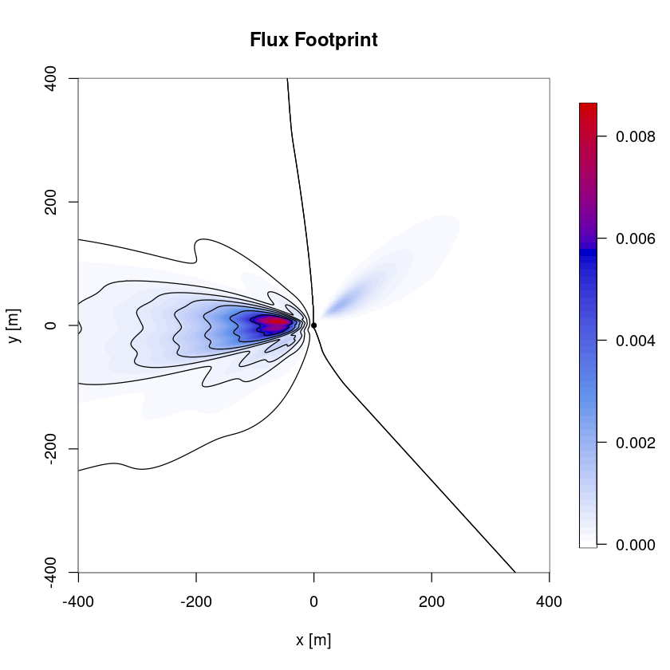

# Flux footprint

## Flux footprint parametrizations
The calculation of a 2d flux footprint makes it possible to estimate the size of the surface that contributes to the measured flux. This also allows to analyze whether changes in the flux result from a change in the footprint (e.g. surface composition, vegetation, surface roughness). Here the flux footprint parametrization according to @Kormann2001 and @Kljun2015 are used. <br>
The mathematical idea for deriving a flux footprint parametrization is to express the flux ($F_c$) as integral over the distribution of its sinks and sources ($S_c$) times a transfer function $f$ (the flux footprint):
$$
    F_c(0,0,z) = \int\int S_c(x,y) f(x,y) \:dx\,dy
$$
By treating streamwise and crosswise velocity independently, the footprint can be expressed as product of the crosswind-integrated footprint ($\overline{f^y}(x)$ which is then only a function of $x$) and a function expressing the crosswind dispersion ($D_y$) through
$$
    f(x,y) = \overline{f^y}(x)D_y.
$$
This assumption leads to a symmetric footprint in crosswind direction. For further derivations a concrete footprint model has to be applied, which is in @Kljun2015 an advanced Lagrangian particle dispersion model (LPDM-B) based on 3d particle backtracking between surface and boundary layer height $h$ that is valid for steady flows under all stabilities. The @Kormann2001 model is a simple analytical transport model. There are several other approaches to flux footprint estimation (e.g. @Hsieh2000), and they result in (quite) different surface areas, so the used method has to be chosen carefully. 


```R
#load Reddy package
#install.packages("../src/Reddy_0.0.0.9000.tar.gz",repos=NULL,source=TRUE,quiet=TRUE)
library(Reddy)

#read in processed example data
dat=readRDS("../data/ec-data_30min_processed/processed_data_example.rds")

#select file
i=8 #daytime example
```

## 2D flux footprint estimate
### Calculate 2D flux footprint estimate with `calc_flux_footprint`
The function `calc_flux_footprint`uses the 2d flux footprint parametrization (FFP) according to @Kljun2015 to calculate the footprint based on measurement height `zm`, mean horizontal wind speed `u_mean`, boundary layer height `h`, Obukhov length `L` (`calc_L`), standard deviation of cross-wind component `v_sd` and either friction velocity `ustar`(`calc_ustar`) or surface roughness length `z0` in a resolution given by `nres`. The boundary layer height can be taken from e.g. ERA5.


```R
#necessary information
zm=4.4 #measurement height in m: 4.4
h=700  #boundary layer height in m: 700

#Kljun et al, 2015
ffp=calc_flux_footprint_Kljun2015(zm=zm,ws_mean=dat$u_mean[i],blh=h,L=dat$L[i],v_sd=dat$v_sd[i],ustar=dat$ustar[i],plot=FALSE)
str(ffp)
```

    List of 8
     $ x                   : num [1:1000] -1073 -1071 -1069 -1067 -1064 ...
     $ y                   : num [1:1000] -1073 -1071 -1069 -1067 -1064 ...
     $ f2d                 : num [1:1000, 1:1000] 0 0 0 0 0 0 0 0 0 0 ...
     $ xcontour            :List of 9
      ..$ : num [1:197] 18.3 17.3 18.3 18.4 19.8 ...
      ..$ : num [1:179] 18.3 18.2 18.3 19.4 20.4 ...
      ..$ : num [1:159] 20.4 19.2 20.4 20.5 22.2 ...
      ..$ : num [1:141] 20.4 20.3 20.4 21.7 22.6 ...
      ..$ : num [1:125] 22.6 21.5 22.6 23.1 24.7 ...
      ..$ : num [1:107] 24.7 22.9 24.7 24.7 26.9 ...
      ..$ : num [1:91] 24.7 24.6 24.7 26.9 26.9 ...
      ..$ : num [1:71] 29 26.9 29 29.8 31.1 ...
      ..$ : num [1:53] 31.1 30.7 31.1 33.3 35 ...
     $ ycontour            :List of 9
      ..$ : num [1:197] -0.752 1.074 2.9 3.222 5.371 ...
      ..$ : num [1:179] 1 1.07 1.15 3.22 4.73 ...
      ..$ : num [1:159] -0.903 1.074 3.052 3.222 5.371 ...
      ..$ : num [1:141] 0.817 1.074 1.331 3.222 4.283 ...
      ..$ : num [1:125] -0.435 1.074 2.583 3.222 4.915 ...
      ..$ : num [1:107] -1.04 1.07 3.19 3.22 5.1 ...
      ..$ : num [1:91] 0.984 1.074 1.164 3.218 3.222 ...
      ..$ : num [1:71] -0.595 1.074 2.743 3.222 4.082 ...
      ..$ : num [1:53] 0.77 1.07 1.38 2.51 3.22 ...
     $ contour_levels      : num [1:9] 0.9 0.8 0.7 0.6 0.5 0.4 0.3 0.2 0.1
     $ crosswind_integrated: num [1:1000] 0 0 0 0 0 0 0 0 0 0 ...
     $ xmax                : num 63.4


Therein, `fy_mean` represents the crosswind-integrated footprint with coordinates `x` and `xmax` the location of the maximum footprint. `(x2d, y2d, f2d)` represent the 2d flux footprint and `(xcontour, ycontour)` the contour lines of the respective contour levels, which can be specified in the `contours`argument in `calc_flux_footprint`. The output list `ffp` can be easily plotted using the function `plot_flux_footprint`, as shown in the following.


```R
#Kormann and Meixner, 2001
i=3
ffp_KM=calc_flux_footprint_KM2001(zm=zm,ws_mean=dat$u_mean[i],wd_mean=dat$wd_mean[i],L=dat$L[i],v_sd=dat$v_sd[i],ustar=dat$ustar[i],plot=FALSE)
str(ffp)
```

    List of 8
     $ x                   : num [1:1000] -1073 -1071 -1069 -1067 -1064 ...
     $ y                   : num [1:1000] -1073 -1071 -1069 -1067 -1064 ...
     $ f2d                 : num [1:1000, 1:1000] 0 0 0 0 0 0 0 0 0 0 ...
     $ xcontour            :List of 9
      ..$ : num [1:197] 18.3 17.3 18.3 18.4 19.8 ...
      ..$ : num [1:179] 18.3 18.2 18.3 19.4 20.4 ...
      ..$ : num [1:159] 20.4 19.2 20.4 20.5 22.2 ...
      ..$ : num [1:141] 20.4 20.3 20.4 21.7 22.6 ...
      ..$ : num [1:125] 22.6 21.5 22.6 23.1 24.7 ...
      ..$ : num [1:107] 24.7 22.9 24.7 24.7 26.9 ...
      ..$ : num [1:91] 24.7 24.6 24.7 26.9 26.9 ...
      ..$ : num [1:71] 29 26.9 29 29.8 31.1 ...
      ..$ : num [1:53] 31.1 30.7 31.1 33.3 35 ...
     $ ycontour            :List of 9
      ..$ : num [1:197] -0.752 1.074 2.9 3.222 5.371 ...
      ..$ : num [1:179] 1 1.07 1.15 3.22 4.73 ...
      ..$ : num [1:159] -0.903 1.074 3.052 3.222 5.371 ...
      ..$ : num [1:141] 0.817 1.074 1.331 3.222 4.283 ...
      ..$ : num [1:125] -0.435 1.074 2.583 3.222 4.915 ...
      ..$ : num [1:107] -1.04 1.07 3.19 3.22 5.1 ...
      ..$ : num [1:91] 0.984 1.074 1.164 3.218 3.222 ...
      ..$ : num [1:71] -0.595 1.074 2.743 3.222 4.082 ...
      ..$ : num [1:53] 0.77 1.07 1.38 2.51 3.22 ...
     $ contour_levels      : num [1:9] 0.9 0.8 0.7 0.6 0.5 0.4 0.3 0.2 0.1
     $ crosswind_integrated: num [1:1000] 0 0 0 0 0 0 0 0 0 0 ...
     $ xmax                : num 63.4


### Plotting of flux footprint with `plot_flux_footprint`

The function `plot_flux_footprint` takes as input an object returned by `calc_flux_footprint` and plots the cross-wind integrated footprint and the 2d footprint.


```R
plot_flux_footprint(ffp) 
```


    
{width=400}
    


```R
plot_flux_footprint(ffp_KM,xlim=c(-0,500),ylim=c(0,500)) #different time step and rotated according to wind direction
```


    
{width=400}
    


## Flux footprint climatology
Flux footprint climatologies can be created as composites of single flux footprints by averaging over several FFP calculations (with `calc_flux_footprint_climatology` for both discussed flux footprint models).


```R
i=1:(dim(dat)[1]) #calculation takes some time
ffp_clim=calc_flux_footprint_climatology(zm=zm,ws_mean=dat$ws_mean[i],wd_mean=dat$wd_mean[i],L=L[i],
                                         v_sd=dat$v_sd[i],ustar=ustar[i],method="KM2001",plot=FALSE)
```


```R
plot_flux_footprint(ffp_clim,xlim=c(-400,400),ylim=c(-400,400)) 
```


    
{width=400}
    


The flux footprint (climatology) can then be plotted on a digital elevation model (DEM), an aerial photo or an ecosystem type classification, see e.g. @Kljun2015 therein Fig. 5 or @Pirk2023 therein Fig. 4.

For Norway, you can download DEM data from geonorge.no, in particular the DTM10 dataset is suitable as flux footprint background (https://kartkatalog.geonorge.no/metadata/dtm-10-terrengmodell-utm33/dddbb667-1303-4ac5-8640-7ec04c0e3918).
