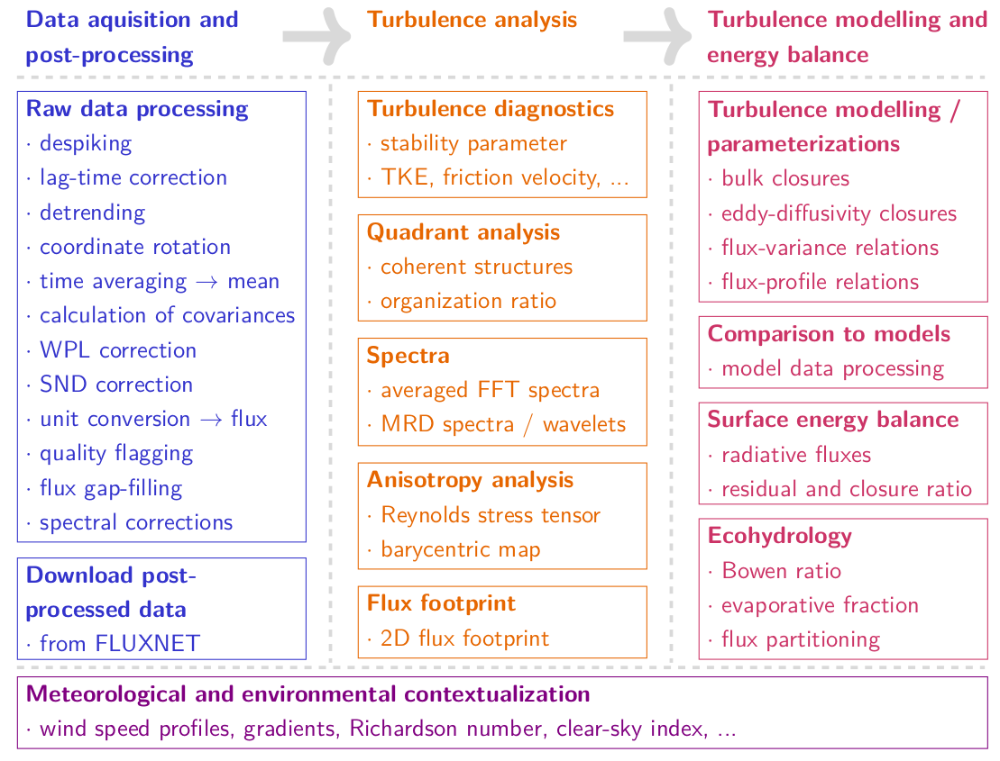
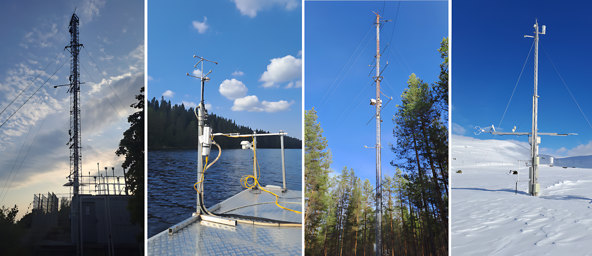
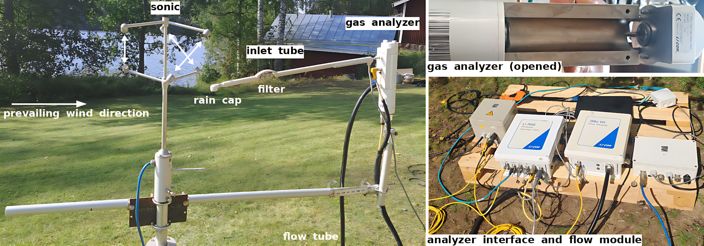

--- 
title: "Reddy: An open-source package for analyzing eddy-covariance data"
author: ""
date: ""
site: bookdown::bookdown_site
output: bookdown::gitbook
documentclass: book
bibliography: [book.bib, packages.bib]
biblio-style: apalike
link-citations: yes
github-repo: noctiluc3nt/Reddy
url: https://noctiluc3nt.github.io/ec_analyze/
description: ""
---


# Introduction

<hr>
**Package**: <a href="https://github.com/noctiluc3nt/Reddy">Reddy package (Github)</a> <br> 
**Jupyter notebooks**: <a href="https://github.com/noctiluc3nt/ec_analyze/tree/main/notebooks">jupyter notebooks (Github)</a><br>
**Publication**: <a href="https://link.springer.com/article/10.1007/s10546-024-00879-5">Link</a><br>
**Any comments or issues?**: <a href="https://github.com/noctiluc3nt/ec_analyze/issues">create an issue (Github)</a>

<hr>

**Overview:** Eddy-covariance (EC) measurements allow to *measure turbulent fluxes directly and non-invasively over long periods of time*, and thus represent the standard measurement method for turbulent exchange processes between atmosphere and land, vegetation, cryosphere or hydrosphere. 
<br>
However, they require a thought-through technical setup and a special post-processing, before further analysis can be carried out. 
This gitbook provides an overview about the setup, post-processing and meteorological evaluation of EC measurements, which can be used for research and teaching. The structure of this gitbook is detailed in figure 1. All described functions are implemented in the R-package Reddy, which was specially developed to allow a reproducible and comprehensive analysis of EC measurements.
Each chapter covers one topic and is also available as jupyter notebook, which can be downloaded  <a href="https://github.com/noctiluc3nt/ec_analyze/tree/main/notebooks">here</a>. 




**Installation of the Reddy package:** The Reddy package can be installed directly from github:
```R
        devtools::install_git("https://github.com/noctiluc3nt/Reddy")
```
Entering a function name `function` in an R terminal, shows the function and the performed calculations, such that the calculation and plotting procedure is fully comprehensible.
The Reddy package depends on the libraries `MASS` (for kernel density estimation), `pracma` (basic linear algebra) and `RcppRoll` (C++ interface for accelerated data handling), which are automatically installed with Reddy.

## Measurement setup and instrumentation

**Setup:**
An EC setup has two main components: the sonic anemometer (for the wind components and temperature) and a gas analyzer (for water vapor, carbon dioxide, methane, ...). 
The sonic usually consists of three pairs of transducers, that transmit and receive ultra-sonic sound waves whose propagation speed depends on wind speed, temperature and humidity. Therefrom, the three wind components and the sonic temperature, which is approximately the virtual temperature, can be derived.
The gas analyzers utilize usually an absorption line in the near- or mid-infrared of the respective trace gas, to measure their number density (IRGA - infrared gas analyzer). The air is pumped from the inlet (with a flow rate of about 12 l/min, that is controlled by the flow module which contains a pump), through the inlet tube into the gas analyzer, where the actual measurement takes place. There are different types of infrared gas analyzer, the most common difference beeing between gas analyzers with closed or open measuring path.
Further possible methods for gas analyzers are laser spectroscopy, mass spectroscopy, chromatography and chemiluminescence (often used for NOx) and also particle flux measurements can be combined with sonic measurements to derive particle fluxes. <br>
The EC system can be mounted on a tower or mast with one or several measurement heights. For choosing the location and measurement height, the surface roughness and the flux footprint (i.e., the area where the flux originates from) are examined. Since the mast or tower disturb the EC measurements, the orientation of the system is chosen based on the prevailing wind direction(s), such that the main wind direction(s) are undisturbed by the tower structures, as exemplified in figure 3. 
The sonics have an internal orientation (and should face north as indicated on the sonic), and they should be levelled (however, their precise levelling is not essential as the wind is rotated in the post-processing anyway). There are several options for the inlet position: Usually it is placed below the sonic (see the setup in Kuivajärvi), but most importantly it should not interfere with the sonic measurements. A detailed description of high-standard EC site setup (following the standards of the Integrated Carbon Observation System, ICOS) can be found in @Rebmann2018.



**Calibration and Maintainance:**
The EC system requires regular maintainance, in particular the gas analyzers. The gas analyzers are calibrated regularly in-field, and more rarely, intensively by the manufacturer. For this prupose, reference measurements are carried out with gas cylinders containing a fixed amount of the gas, e.g. zero-gas or 450 ppm CO$_2$. For water vapor, usually only the zero-gas calibration is performed, since fixed water vapor concentrations are difficult to maintain. For other trace gases, the in-field calibration is performed with a zero-gas and another fixed concentration, while the manufacturer calibrates for several fixed gas concentrations.
The optics of the gas analyzer have to be cleaned regulary depending on the environmental conditions, whereby open-path gas analyzers require more maintainance than closed-path gas analyzers.
Additionally, the inlet filters should be cleaned or replaced regulary as well as the sampling tube. The sonic requires less maintainance, however, the measurements are sensitive to the distance of the transducer pairs, so their distance should be checked. 



## Data sources
**FLUXNETs:**
There are several coordinated FLUXNETs, which standardise eddy-covariance measurements regionally or globally and provide post-processed flux data. For example:<br>

- <a href="https://fluxnet.org">FLUXNET</a>: FLUXNET combines several regional networks to a global flux dataset. A list of regional networks can be found <a href="https://fluxnet.org/about/regional-networks/">here</a> and a list of stations <a href="https://fluxnet.org/sites/site-list-and-pages/">here</a>.
The most recent global flux data set is <a href="https://fluxnet.org/data/fluxnet2015-dataset/">  FLUXNET2015</a> [@Pastorello2020].
- <a href="https://www.icos-cp.eu/">ICOS</a>: ICOS (Integrated Carbon Observation System) is a European network of different station types (Atmosphere, Ecosystem, Ocean), which observe carbon concentrations and fluxes. The atmospheric stations are listed <a href="https://www.icos-cp.eu/observations/atmosphere/stations">here</a> and data can be downloaded from the
<a href="https://data.icos-cp.eu/portal/#%7B%22filterCategories%22:%7B%22project%22:%5B%22icos%22%5D,%22level%22:%5B1,2%5D,%22stationclass%22:%5B%22ICOS%22%5D%7D%7D">data portal</a>.


**Other packages for processing of eddy-covariance data:** Multiple other packages for eddy-covariance data processing exist with different applications and different degrees of specialization as well as in different languages. The main focus of these packages, however, is the post-processing of raw eddy-covariance data (often as wrapper of manufacturer software) and long-term ecosystem monitoring studies, as summarized below. 
In this regard, [Reddy](https://github.com/noctiluc3nt/Reddy) <span style="color: darkblue;">**R**</span> fills a gap, as it additionally considers turbulence theoretical and meteorological applications and allows for a fully customized post-processing and analysis of eddy-covariance data. <br>

- [EddyPro®](https://github.com/LI-COR-Environmental/eddypro-engine) <span style="color: darkblue;">**Fortran**</span>: Post-processing of eddy-covariance data from the manufacturer LI-COR Biosciences.
- [ONEFlux](https://github.com/fluxnet/ONEFlux) <span style="color: darkblue;">**C**</span> ("Open Network-Enabled Flux processing pipeline"): Post-processing of (half-)hourly eddy-covariance data used to create the FLUXNET2015 dataset [@Pastorello2020].
- [REddyProc](https://cran.r-project.org/web/packages/REddyProc/index.html) <span style="color: darkblue;">**R**</span>: Post-processing of (half-)hourly eddy-covariance measurements.
- [openeddy](https://github.com/lsigut/openeddy) <span style="color: darkblue;">**R**</span>: Post-processing of eddy-covariance data, aligned with REddyProc.
- [RFlux](https://github.com/domvit81/RFlux/) <span style="color: darkblue;">**R**</span>: GUI for post-processing of eddy-covariance raw data by calling EddyPro®.
- [eddy4R](https://github.com/NEONScience/eddy4R) <span style="color: darkblue;">**R**</span> [@Metzger2017] : Family of several R-package for eddy-covariance post-processing in a DevOps framework.
- [icoscp](https://pypi.org/project/icoscp/) <span style="color: darkblue;">**Python**</span>: Access to data from ICOS (Integrated Carbon Observation System) data portal.
- [flux-data-qaqc](https://github.com/Open-ET/flux-data-qaqc) <span style="color: darkblue;">**Python**</span> [@Volk2021] : Post-processing of eddy-covariance measurements to derive daily or monthly evapotranspiration in a energy balance framework.
